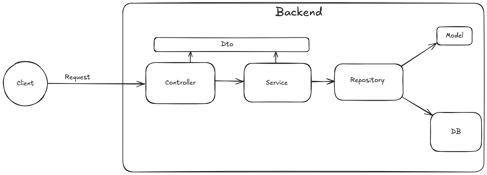

- Organization: [Internet Health Report](https://github.com/InternetHealthReport)
- Project: [Migrate IHR API](https://github.com/InternetHealthReport/ihr-api) 
- Contributor: Ibraam Nashaat
- GitHub: [Ibraam-Nashaat](https://github.com/Ibraam-Nashaat)
- LinkedIn: [Ibraam Nashaat](https://www.linkedin.com/in/ibraamnashaat/)
- GSoC Proposal: [Proposal Link](https://drive.google.com/file/d/1YiKreKstXwUsvN7wzWkckbMZ1ztn0vC6/view?usp=sharing)

## 1. Project Goals

The goal of this project is to modernize and simplify the Internet Health Report (IHR) API by replacing its outdated Django 2.2.27 implementation with FastAPI, a lightweight, high-performance, asynchronous framework that provides built-in interactive API documentation via Swagger UI.

This migration will:

- Migrate all API endpoints from Django to FastAPI.

- Remove deprecated and unused code to reduce complexity and improve maintainability.

- Containerize the application with Docker to ensure a consistent and portable runtime environment across various deployment setups.

By implementing these architectural changes, the project aims to improve performance, simplify maintenance, and provide a cleaner, more modular codebase for future development.

## 2. Work Done

This project follows a **Controller-Service-Repository** architecture for modularity, scalability, and maintainability. The layers are clearly separated for cleaner code and easier testing.

* **Controller Layer :**  Handles HTTP requests, calls services, and returns structured responses.
* **Service Layer :**  Encapsulates business logic, enforces rules, and delegates data access to repositories, keeping controllers decoupled from domain logic.
* **Repository Layer :**  Abstracts database interactions, providing structured and reusable data access methods.
* **DTOs :**  Define and validate data formats between layers, ensuring consistent API requests/responses and isolating models from external communication.
* **Model Layer :**  Defines database schemas, relationships, field types, and constraints, mapping directly to tables and integrating with repositories.

### 2.1. API Endpoints Migration

Migrated the following endpoints from Django to FastAPI:

- `/networks/`
- `/countries/`
- `/disco/events/`
- `/hegemony/`
- `/hegemony/alarms/`
- `/hegemony/countries/`
- `/hegemony/prefixes/`
- `/hegemony/cones/`
- `/network_delay/`
- `/network_delay/locations/`
- `/network_delay/alarms/`
- `/metis/atlas/selection/`
- `/metis/atlas/deployment/`
- `/tr_hegemony/`

### 2.2. Dockerization

Containerized the application with Docker to provide a consistent, portable runtime environment for all deployment setups.

## 3. Merged Pull Requests

The accepted pull requests that contain my work:
* [PR #31 – Return recent results when timebin fields are not provided ](https://github.com/InternetHealthReport/ihr-api/pull/31)
* [PR #30 – Added page size to .env file](https://github.com/InternetHealthReport/ihr-api/pull/30)
* [PR #29 – Added /hegemony, /hegemony/countries and /hegemony/prefixes endpoints](https://github.com/InternetHealthReport/ihr-api/pull/29)
* [PR #22 – Added /disco/events, /tr\_hegemony and /hegemony/alarms endpoints](https://github.com/InternetHealthReport/ihr-api/pull/22)
* [PR #17 – Added network delay and metis endpoints and removed link endpoints](https://github.com/InternetHealthReport/ihr-api/pull/17)
* [PR #15 – Added /network\_delay/locations endpoint](https://github.com/InternetHealthReport/ihr-api/pull/15)
* [PR #13 – Added link forwarding endpoint](https://github.com/InternetHealthReport/ihr-api/pull/13)
* [PR #11 – Added /link/delay endpoint](https://github.com/InternetHealthReport/ihr-api/pull/11)
* [PR #9 – Added /networks endpoint](https://github.com/InternetHealthReport/ihr-api/pull/9)
* [PR #8 – Removed some foreign key constraints and returned some primary keys to integer](https://github.com/InternetHealthReport/ihr-api/pull/8)
* [PR #6 – Added database models and /hegemony/cones endpoint](https://github.com/InternetHealthReport/ihr-api/pull/6)
* [PR #2 – Country endpoint](https://github.com/InternetHealthReport/ihr-api/pull/2)

